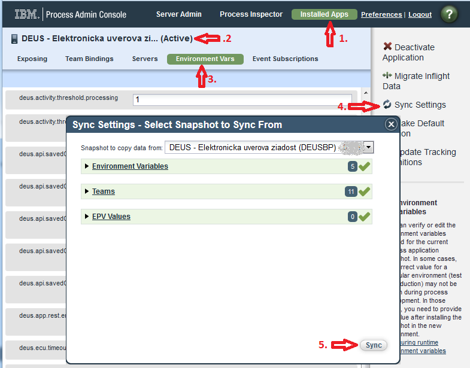
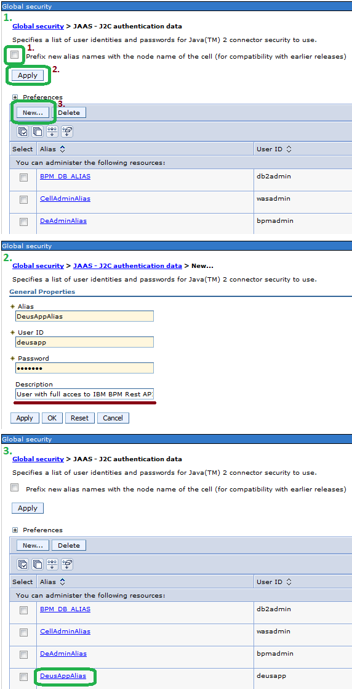
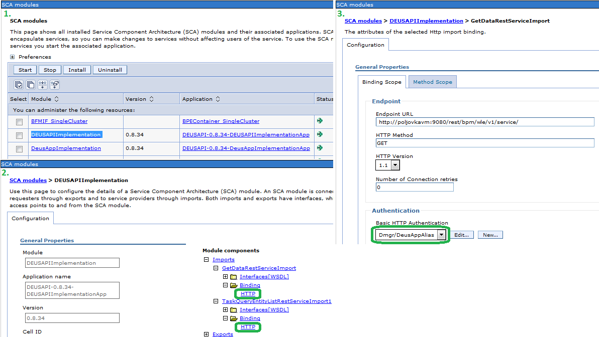
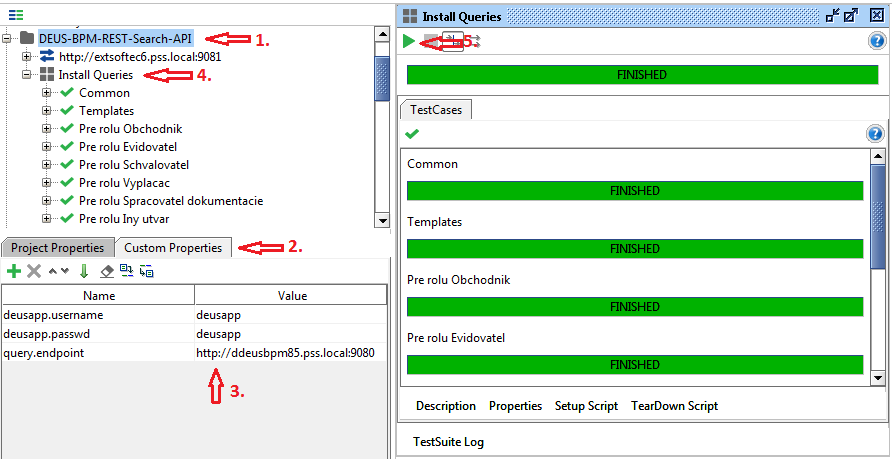
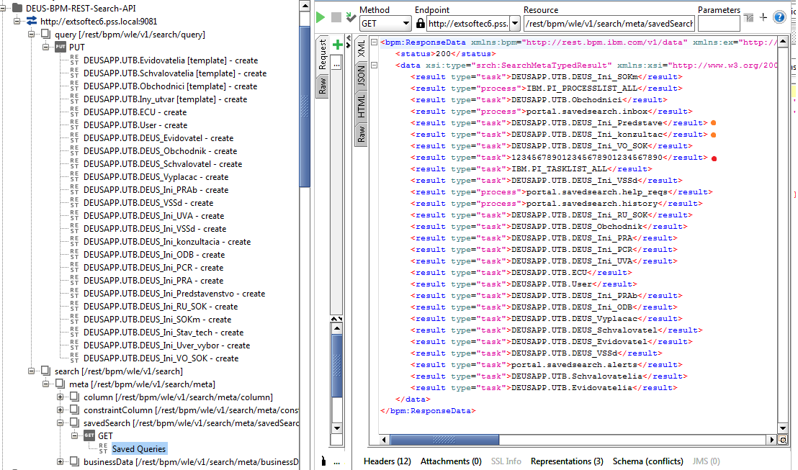

Inštálacia
==========

1. Import TWX do IBM BPM
2. Definovanie tímov v IBM BPM
3. Konfigurácia Toolkit-u
4. Konfigurácia Aplikácie
5. Vytvorenie Saved Search Queries

Import TWX do IBM BPM
---------------------

Business Process aplikácia pozostáva z:
1. Toolkit-u "DEUS - Rozhrania"
   - "DEUS_-_Rozhrania - verzia.twx"
2. aplikácie "DEUS - Elektronicka uverova ziadost"
   - "DEUS_-_Elektronicka_uverova_ziadost - verzia.twx"

Uvedené exporty sú umiestnené v adresári exports.

Exporty (posledné verzie) je potrebné importnú do IBM BPM Repository podľa zaužívaných postupov alebo dokumentácie k produktu.

Pri inštalácii novej verzie procesnej aplikácie odporúčame synchronizovať nastavenia z poslednej verzie do novej verzie cez Process Admin Console.

Definovanie tímov v IBM BPM
---------------------------

Podmienkou pre vykonanie tohto kroku je:
1. konfigurácia IBM WebSphere Cell s custom federated user registry na Kwiera systém
2. zadefinovanie skupín v Kwiera pre jednotlivé role.

Pre aplikáciu "DEUS - Elektronická úverová žiadosť" je potrebné zadefinovať členov jednotivých tímov:
   - Obchodníci
   - Evidovatelia
   - Schvaľovatelia
   - SpracovateliaDokumentov
   - Vyplácači
   - Supervizori

Konfigurácia Toolkitu
---------------------

Toolkit obsahuje komponenty pre technické napojenie sa na externé a interné systémy a takisto poskytuje rozhrania pre webovú aplikáciu DEUS.

### Definovanie endpointov:

__deus.app.rest.endpoint__

Webová aplikácia DEUS poskytuje REST služby na adrese napr. http://wastest:9080/deus-services/api/ .
Overenie funkčnosti v prehliadači http://wastest:9080/deus-services/api/application/{ECU}

__ibs.rest.ecu.endpoint__

Rezervácia resp. uvoľnenie EČU je realizované prostredníctvom REST služby v systéme IBS na adrese napr. http://wastest:9080/ecuws/rest/ecu/ .
Overenie funkčnosti v prehliadači http://wastest:9080/ecuws/swagger-ui.html

__ibm.api.rest.savedQuery.endpoint__
a
__ibm.api.rest.taskData.endpoint__

Interné REST API od IBM pre prístup UserTask-om môže byť odkazovaná cez localhost
http://localhost:9081/rest/bpm/wle/v1/tasks/query/
a
http://localhost:9081/rest/bpm/wle/v1/service/
alebo cez LB, pričom je potrebné zabezpečiť konektivitu (sám na seba cez LB).

__ibm.api.rest.securityAlias__

Pre prístup k IBM REST API je potrebné použíť autentikovaný pristup prostredníctvom J2C auth (IBM WAS Admin Console: Global security > JAAS - J2C authentication data).Uvedené konto musí mať admin prístup k BPM REST API.
Odporúčame pre tento konfiguračný kľúč nechať na hodnote DeusAppAlias a zadefinovať ho v J2C auth.

### Konfigurácia Saved Search Query

Prístup ku košom úloh pre jednotlivé role, používateľov a k EČU sa v aplikácií využívajú tzv. Saved Search Queries (viď. Saved Search Admin v IBM BPM Process Admin Console).

__deus.api.savedQuery.*__

Názvy jednotlivých Saved Search Queries začínajú reťazcom _DEUSAPP.UTB._ , aby boli oddelené od ostatných, ktoré možno používajú iné aplikácie alebo správcovia. (Upozornenie: V IBM BPM verzii nižšej ako 8.5.5 je chyba, kedy jednotlivé Saved Search Queries si môžu používatelia prepisovať)
Saved Search Queries:
   - _DEUSAPP.UTB.ECU_: sa používa pre vyhľadanie aktívnych DEUS-ov
   - _DEUSAPP.UTB.User_: sa používa pre vyhľadanie priradených DEUS-ov
   - _DEUSAPP.UTB.(rola)_: sa používa ako šablóna jednotlivý rolí (tím v BPM) pre vytvorenie skupinového pracovného koša
   - _DEUSAPP.UTB.(skupina)_: sa používa ako skupinové pracovné koše pre jednotlivé skupiny

Vytvorenie uvedených Saved Search Queries je popísané nižšie.

Konfigurácia Aplikácie
----------------------

Konfigurácia aplikácie pozostáva najmä z definovania časových ohraničení (_*.threshold.*_) pre jednotlivé aktivity a aj celý proces spracovania DEUS-u.

Vytvorenie Saved Search Queries
-------------------------------

Pre vytvorenie jednotlivých Saved Search Queries je potrebné použiť aplikáciu SOAPui (https://www.soapui.org/). V adresári scripts sa nachádza SOAPui projekt _DEUS-BPM-REST-Search-API-soapui-project.xml_, ktorý je potrebné Importnúť do SOAPui.

Tento projekt má nadefinované a je potrebné nastaviť v soapUI Project properties:
   - __query.endpoint__ URL base pre IBM BPM
   - __deusapp.username__ a __deusapp.passwd__ ako auth pre IBM BPM REST služby

Automaticka inštalácia všetkých SavedSearchQueries sa vykoná prostredníctvom TestSuite "Install Queries" (viď. obrázok 1).
Ešte je možné výsledok overiť aj v Saved Search Admin v IBM BPM Process Admin Console alebo cez volanie SOAPui služby SavedSerch (viď. obrázok 2).

Custom properties je možné mahrať z properties súboru pre dané prostredie. Príklad je v súbore scripts/DEUS-BPM-REST-Search-API-dev2.properties

__Upozornenie:__ IBM BPM nepodporuje pre Saved Search Query nazov dlhší ako 30 znakov. Preto je názov Query orezané na 30 znakov v definícii Query (viď. príklad na obrázku označené farebnou bodkou), ale aj v aplikácii, kde skupinový kôš využíva Query s orezanim na presne 30 znakov.

__Príklad vytvorenia nového skupinového koša:__

Ak chceme, aby skupina používateľov s názvom skupiny 'DEUS_XYZ' mala dostupný pracovný kôš pre rolu Evidovateľ tak, je potrebné urobiť kópiu/clone requestu _DEUSAPP.UTB.Schvalovatelia_ a v requeste zmeniť parameter _saveAsName_ na _DEUSAPP.UTB.DEUS\_XYZ_
